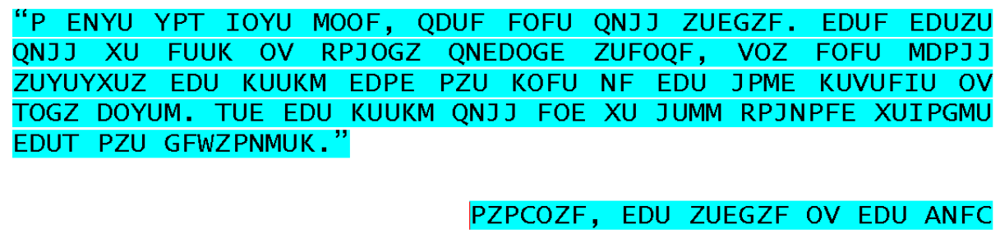
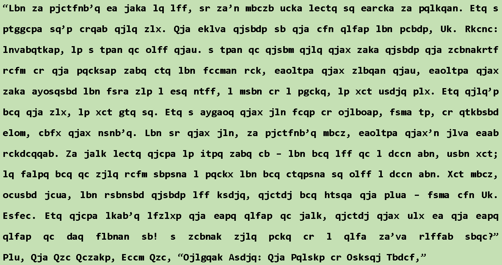
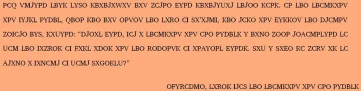

# Cifra-de-Cesar
Gerador - Cifra de César

Como parte da disciplina de criptografia, foi proposta a atividade de desenvolver um código que convertesse o texto puro em texto cifrado, baseado na cifra de César.

<h2>Texto Cifrado 1</h2>
</img>
 
<h2>Texto Cifrado 2</h2>
</img>
 
<h2>Texto Cifrado 3</h2>
</img>
